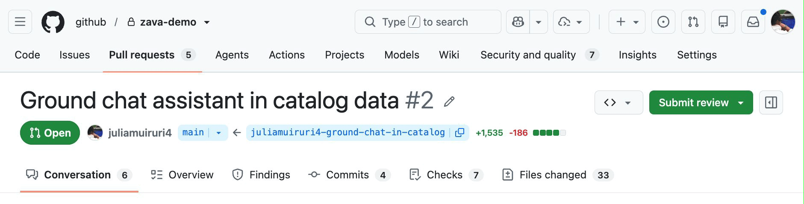
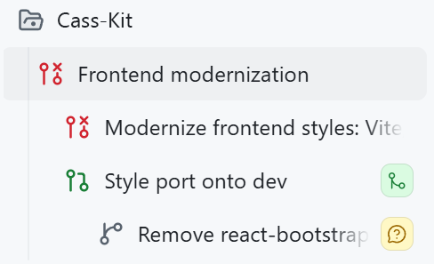
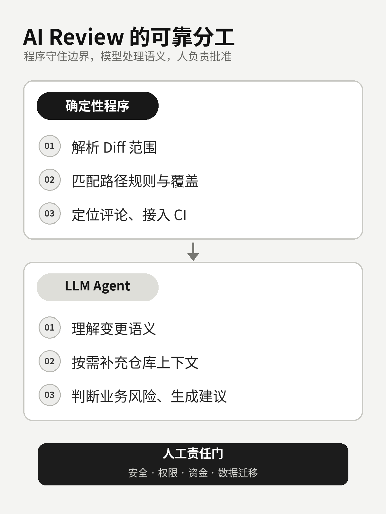
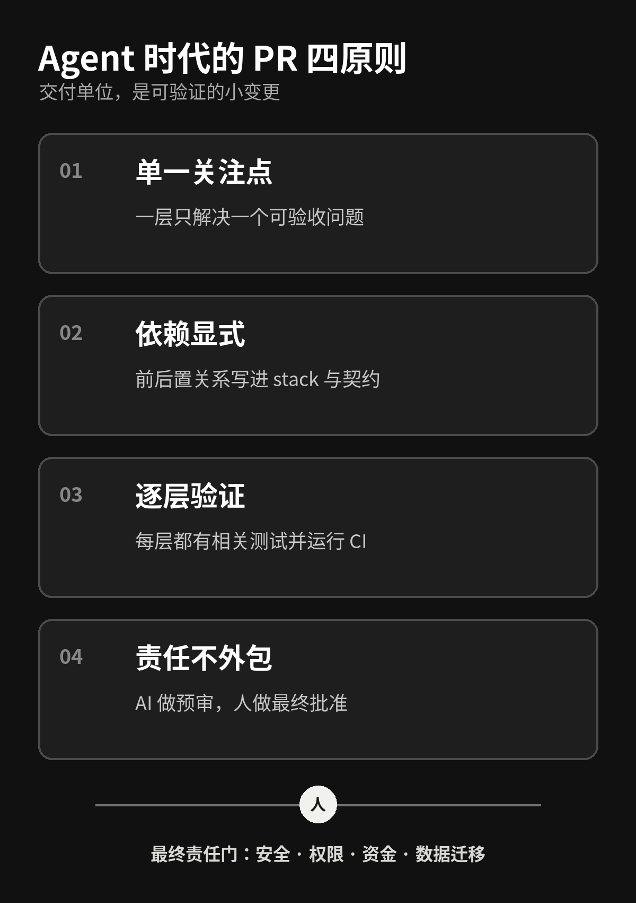

# AI 一次能写 1000 行代码后，我反而更不敢合并了

AI Coding 最直观的变化，是代码真的写得越来越快了。

过去需要半天才能搭好的接口、页面和测试，现在交给 Coding Agent，短时间内就可能生成一整套实现。可当它以一个上千行 PR 出现在仓库里，团队真正的问题才刚刚开始：谁来确认它改对了？遗漏了什么？出了问题，能不能只回滚其中一部分？

GitHub 8 月 4 日发布的一篇工程文章里，就有一个很典型的案例。Agent 为购物助手生成商品搜索功能，一次形成大约 1,721 行变更，里面同时混着数据目录、搜索 API、聊天接入和前端引用卡片。

这 1,721 行只是教程案例，不是行业平均数据。但它准确暴露了一个正在出现的新瓶颈：

> AI 缩短的是“从需求到代码”的时间，不是“从代码到可信变更”的时间。

代码生成的边际成本下降了，人的理解、验证和责任带宽却没有同步增长。AI Coding 越快，团队越需要重新设计代码如何进入评审、测试和合并流程。



*图 1｜GitHub 官方教程中的示例 PR。来源：GitHub Blog。*

## 新瓶颈不是产码，而是理解带宽

大 PR 一直不好审，AI 只是让它更容易发生。

Agent 可以同时修改几十个文件，把功能实现、重构、格式化和依赖调整一起交出来。对生成端来说很高效，对评审端来说却像突然收到一个没有目录的压缩包。

首先是理解成本。数据结构、接口、业务调用和 UI 状态混在一张 diff 里，reviewer 必须同时建立多个心智模型。代码本身可能不复杂，频繁切换上下文仍会拖慢评审，也更容易漏掉边界条件。

其次是返工成本。底层字段有问题，上层接口、调用和展示可能都要跟着改。修改完成后，reviewer 往往需要重新检查整块变更，很难确认影响到底停在哪里。

最后是合并成本。一个 PR 包含的关注点越多，回滚粒度越粗。CI 绿灯只能证明已经写进测试和规则的部分通过了，不能证明业务意图、权限边界和上线风险都正确。

所以“小 PR”的重点不是机械限制行数。Google 的代码评审实践把它定义得更准确：一个小变更应该是一项自包含的改变，带着相关测试，审查上下文足够，而且每次合入后系统仍然可工作。

如果把一个大功能硬切成十个无法独立验证的碎片，reviewer 只会得到十次不完整的上下文。真正要拆的是关注点、依赖和验收边界。

## GitHub 的解法：把 PR 从一个包裹变成依赖图

GitHub 最近连续释放了两个信号。

7 月 30 日，GitHub Copilot app 分享了 stacked sessions 的实践：作者第一次想 one-shot 完成旧项目的前端现代化，结果失败。后来她把样式迁移和移除 `react-bootstrap` 拆成前后依赖的 session，每个 session 对应独立 PR。



*图 2｜一次前端现代化任务被拆成前后依赖的 session。来源：GitHub Blog。*

8 月 4 日，GitHub 又把那个约 1,721 行的商品搜索功能拆成了四层 stacked PR：

```text
main
└─ PR1：商品数据与校验
   └─ PR2：搜索 API
      └─ PR3：聊天业务接入
         └─ PR4：引用卡片与异常状态
```

Stacked PR 的关键不是 PR 数量变多，而是依赖关系变得可见。第一层面向 `main`，后续每层以前一层分支为基线。reviewer 在每个 PR 中只看这一层新增的 diff，同时又能知道它位于整条链的什么位置。

这样做的现实价值很直接：数据、API 和 UI 可以由不同 owner 分层评审；每层都运行 CI；底层没有通过时，上层不会被误认为已经具备合并条件；任何一层需要返工，影响范围也更清楚。

但 stacked PR 没有消灭复杂性。底层改动后，上层仍需要级联 rebase；冲突、分支同步和团队流程改造成本依然存在。GitHub 当前把这项能力标为 Public Preview，仍可能变化，而且分支必须位于同一仓库，GitHub Desktop 暂不支持。

所以不必把它神化成万能工作流，也不必等某个工具完全成熟才开始。即使只用普通 Git 分支，团队也可以先实践同样的原则：把大任务表达成一张有依赖顺序的变更图。

## 为什么再加一个 Review Agent 还不够

看到人的评审带宽不够，最自然的反应是：再部署一个 AI Review Agent 不就行了？

它当然有价值。但如果只是把 diff 扔给另一个模型，再用提示词要求“认真检查”，问题并没有真正解决。模型可能漏看文件、把错误规则用在错误目录、给出漂移的评论位置，也可能生成大量看起来专业、实际优先级很低的建议。

阿里开源的 OpenCodeReview 值得关注，不是因为它证明了 AI 可以接管 review，而是它展示了一种更合理的工程分工：确定性的事情交给程序，需要语义理解的事情再交给 LLM。

| 确定性程序负责 | LLM Agent 负责 |
|---|---|
| 解析 Git diff 和审查范围 | 理解当前变更的语义 |
| 过滤文件、匹配路径规则 | 按需读取文件和搜索仓库 |
| 记录覆盖、定位评论行号 | 判断业务逻辑和上下文风险 |
| 结构化输出、接入 CI | 生成问题说明与修复建议 |



*图 3｜确定性程序守住覆盖与定位，LLM 处理上下文与语义，人负责最终批准。*

它的公开实现会按文件或文件组运行相对隔离的评审子任务，需要跨文件信息时再通过工具读取。这样可以控制上下文和并发，也能保证目标进入流程。但默认策略并不天然正确，团队仍要检查 include、exclude 和路径规则，确认测试文件、生成文件和大文件是否被正确覆盖。

项目的开放 Issue 里也能看到重复评论、大文件策略、稳定 finding 标识等问题仍在演进。官方 benchmark 可以说明项目方的目标，不能直接作为优于人工的独立证据。

一篇 2026 年的代码评审 Agent 研究也提供了必要的警示。在论文选取的开源数据子集中，纯 Agent 评审 PR 的合并率为 45.20%，纯人工评审为 68.37%。但这只是特定数据集上的相关性结果，不能推导出“AI 评审导致 PR 无法合并”，也不能直接外推到企业私有仓库。

更稳妥的结论是：AI Review 适合做预审层和语义扫描层，不适合成为责任转移层。

## Agent 时代，PR 至少要守住四条原则

如果团队已经在使用 Coding Agent，我建议先建立四条简单规则。

### 1. 单一关注点

一个 Agent 任务只解决一个可描述、可验收的问题。功能实现、顺手重构、依赖升级和大范围格式化不要混在同一层。发现 scope creep，就新开一层，而不是继续把当前 PR 做大。

### 2. 依赖显式

把前后置关系写进分支或 stack，也写进 PR 描述和接口契约。每个 PR 至少回答四个问题：为什么改，这一层改什么，明确不改什么，如何证明它完成了。

### 3. 逐层验证

每一层都带上相关测试，独立运行 lint、类型检查、单测或必要的 E2E。验证不能只在整条链的最后执行。底层失败时，上层即使自己绿灯，也不应该进入合并队列。

### 4. 责任不外包

确定性规则检查已知问题，LLM 扫描语义风险，人按风险等级批准。文档和低风险配置可以抽查；普通业务变更需要人工批准；涉及安全、权限、资金、数据迁移的改动，应由领域 owner 把关。



*图 4｜把 Agent 产能收敛成可描述、可验证、可追责的小变更。*

团队可以把它收敛成一句规则：

> Agent 可以提交变更、运行检查和提出意见，但不能同时定义验收标准、证明自己通过，再批准自己上线。

这不是对 AI 不信任，而是软件工程里最基本的职责分离。模型越能自主行动，验收边界越要提前写清楚。

## 程序员的价值，正在迁移到边界设计和验收

AI Coding 时代，程序员当然还需要写代码。但更稀缺的能力会逐渐从“把实现敲出来”，转向“把变化组织成团队可以信任的交付单元”。

你要能把模糊需求拆成依赖图，为每一层定义输入、输出、测试和回滚方式；要知道哪些稳定约束应该进入 lint、静态分析和 CI，哪些业务判断可以让 LLM 提供线索，哪些风险必须由人承担。

团队的指标也应该跟着变化。与其统计 AI 生成了多少行代码，不如关注 review 等待时间、返工轮数、缺陷逃逸率和回滚恢复时间。前者衡量的是产出速度，后者才更接近真实交付能力。

未来程序员不只是代码生产者，还会越来越像变更边界的设计者和验收负责人。

AI 可以把一千行代码写得很快。真正决定团队能不能更快交付的，是我们能否把这一千行代码变成一组可理解、可验证、可回滚的小变更。

## 参考资料

1. GitHub Blog：[Turn one giant AI-generated pull request to a reviewable stack](https://github.blog/engineering/turn-one-giant-ai-generated-pull-request-to-a-reviewable-stack/)
2. GitHub Blog：[Stacked sessions and pull requests in the GitHub Copilot app](https://github.blog/ai-and-ml/github-copilot/stacked-sessions-and-pull-requests-in-the-github-copilot-app/)
3. GitHub Docs：[About stacked pull requests](https://docs.github.com/en/pull-requests/get-started/about-stacked-prs)
4. Alibaba：[OpenCodeReview](https://github.com/alibaba/open-code-review)
5. Alibaba OpenCodeReview：[Architecture](https://github.com/alibaba/open-code-review/blob/main/pages/src/content/docs/zh/architecture.md)
6. Google Engineering Practices：[Small CLs](https://google.github.io/eng-practices/review/developer/small-cls.html)
7. Chowdhury 等：[From Industry Claims to Empirical Reality: An Empirical Study of Code Review Agents in Pull Requests](https://arxiv.org/abs/2604.03196)
