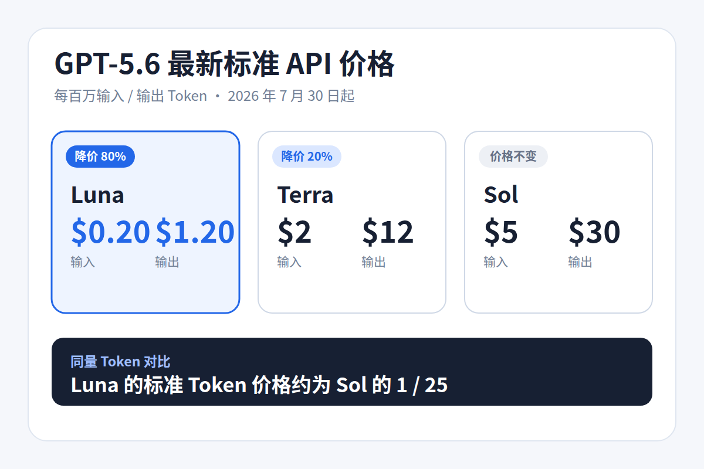
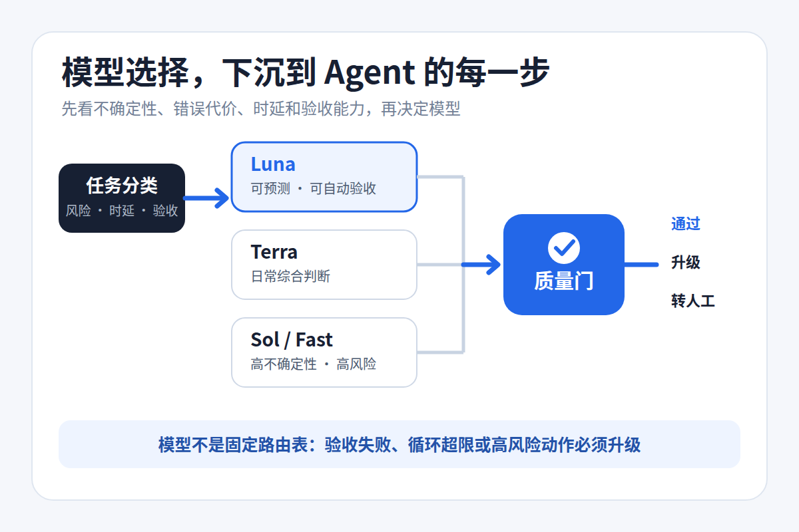
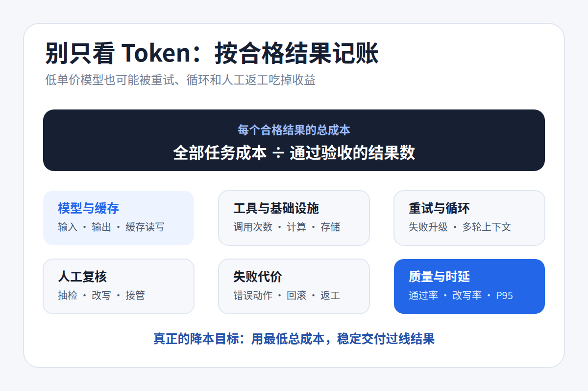

# GPT-5.6 Luna 降价 80%，真正该改的不是模型，而是 Agent 架构

7 月 30 日，OpenAI 把 GPT-5.6 Luna 的 API 价格下调了 80%。每百万输入 / 输出 Token 的标准价格，从 1 / 6 美元降到 0.20 / 1.20 美元。

Terra 同期降到 2 / 12 美元，降幅 20%。Sol 标准价仍是 5 / 30 美元；Sol Fast mode 最高可达到标准处理的 2.5 倍速度，价格也是 2 倍。

这些都是短上下文的标准价。超过 272K 输入会进入长上下文计费，缓存写入和工具调用也可能产生额外费用。

按相同的输入、输出 Token 量计算，Luna 只要 Sol 的 1/25。如此大的价差，会让很多团队产生一个直觉：把 Agent 的默认模型换成 Luna，账单就能立刻下来。

事情没这么简单。



<small>图 1｜7 月 30 日起的标准 API 价格。数据来源：OpenAI 官方公告。</small>

## 单价低，不等于任务成本低

普通问答可能只调用一次模型，Agent 却要连续规划、检索、使用工具、执行和验证。每一步都可能再次携带上下文，走错后还会重试。

如果规划阶段理解错了需求，后面执行得再便宜也是浪费。低价模型多跑五轮工具，最后还得交给强模型重做，账单未必会更低。涉及发布、付款或删除资源时，一次错误造成的损失更不是几美元 Token 费能抵消的。

所以我更建议团队看“每个合格结果花了多少钱”。Token 单价只是这笔账里的一个数。

## 模型选择，要落到 Agent 的每一步

OpenAI 在公告里给了一个编码工作流：先让 Sol 消除不确定性、定义计划，再由 Luna 完成明确修改、编写和运行测试、评估结果。

这个例子说清了分工思路，却不是固定答案。官方也提醒，不同工作流会有不同组合。

结构化抽取、固定格式转换，或者能用测试自动验收的批量步骤，可以先评估 Luna。日常 RAG 回答和常规业务分析，可能更适合 Terra。需求澄清、复杂规划、高风险代码审查，则更有理由使用 Sol。

该选哪一档，至少要看四件事：任务有多大不确定性，出错有多贵，用户是否在等待，以及结果能不能自动验收。

```text
任务分类
  ├─ 可预测、可自动验收  → Luna
  ├─ 需要日常综合判断    → Terra
  └─ 高不确定性或高风险  → Sol / Sol Fast
                ↓
              质量门
        通过 / 升级 / 转人工
```



<small>图 2｜路由不是固定选型表，关键是质量门、失败升级和人工接管。</small>

接入多个模型只是第一步。每一步还要有质量门：结构化输出校验字段，代码修改跑测试，检索回答检查引用覆盖。没过线就升级模型；达到循环上限，或触及高风险操作，就交给人。

Fast mode 也要分开看。它用溢价换低延迟，适合用户正在等待的高价值请求。后台任务通常没必要为“更快”多付一倍。

## 别只盯着 Token 账单

一条更接近真实业务的公式是：

```text
每个合格结果的总成本
=（模型 Token + 工具调用 + 基础设施 + 重试
  + 人工复核 + 失败代价）÷ 通过验收的结果数
```

具体到一次 Agent 运行，至少记录实际路由模型、输入和输出 Token、缓存读写、工具调用、循环与升级次数，再加上自动通过率、人工改写率和 P95 延迟。

缓存也不能只看命中率。GPT-5.6 的缓存写入按未缓存输入价的 1.25 倍收费。只有稳定前缀被后续请求反复读取，缓存才可能省下真金白银。

OpenAI 还披露，Sol 参与生产 Kernel 优化后，端到端模型服务成本降低 20%；相关推测模型实验让 Token 生成效率提高 15% 以上。这是 OpenAI 自己的生产结果，并不代表普通团队照着做也能省出同样比例。

更值得借鉴的是它算账的范围：请求路由、上下文、缓存、工具输出和重复工作，全都属于 Agent 成本。



<small>图 3｜Agent 降本的计量单位，应从 Token 单价扩展到合格结果。</small>

## 先用五步做一次小改造

第一步，选 3～5 个稳定任务类别，比如结构化抽取、RAG 回答、代码修改和结果总结。别急着做一个能判断所有任务的“万能路由器”。

第二步，为每类任务写清验收标准，用同一批真实样本测试 Luna、Terra 和 Sol。成功率、总 Token、工具调用、重试和延迟都要记录。

第三步，找出能够稳定过线的最低成本模型。先用影子模式记录路由建议，不立刻切生产流量。

第四步，加上失败升级、循环上限和人工责任门，再小流量灰度。模型便宜了，可以扩大执行规模，不能顺便扩大权限。

第五步，等路由稳定后再优化处理档位和缓存。在线请求看低延迟是否值钱，后台任务用 Standard，异步或低优先级任务再评估 Batch / Flex。

模型路由会越来越像数据库读写分离。多写几个模型名称并不难，难的是让流量分类、质量门、失败回退和成本观测稳定运行。

Luna 的 80% 降价，确实让高频、后台和批量型 Agent 更容易算过经济账。团队能否拿到这笔红利，取决于能不能让高价模型处理昂贵的不确定性，把可验证的规模交给便宜模型。

## 参考资料

1. OpenAI：[Advancing the price-performance frontier with GPT-5.6](https://openai.com/index/advancing-the-price-performance-frontier-with-gpt-5-6/)
2. OpenAI Developers：[API Pricing](https://developers.openai.com/api/docs/pricing)
3. OpenAI：[How GPT-5.6 fuses frontier intelligence with frontier efficiency](https://openai.com/index/gpt-5-6-frontier-intelligence-efficiency/)
4. OpenAI Developers：[Fast mode](https://developers.openai.com/api/docs/guides/fast-mode)
5. OpenAI Developers：[Prompt caching](https://developers.openai.com/api/docs/guides/prompt-caching)
6. OpenAI Developers：[Evaluation best practices](https://developers.openai.com/api/docs/guides/evaluation-best-practices)
7. Anthropic：[Building effective agents](https://www.anthropic.com/engineering/building-effective-agents)
8. LMSYS：[RouteLLM: Learning to Route LLMs with Preference Data](https://arxiv.org/abs/2406.18665)
