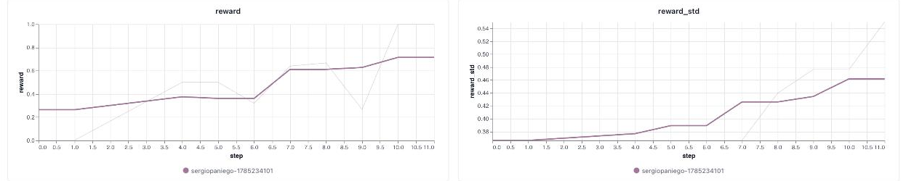
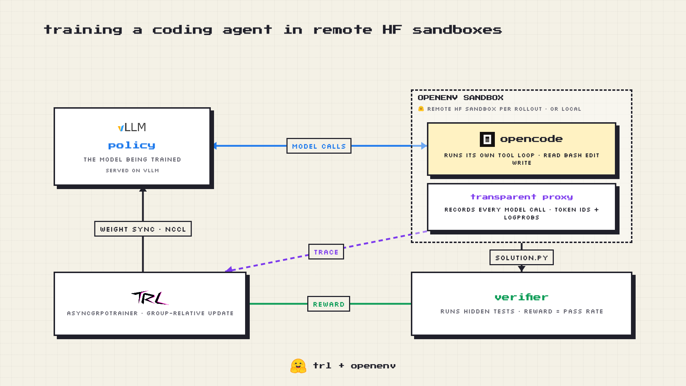
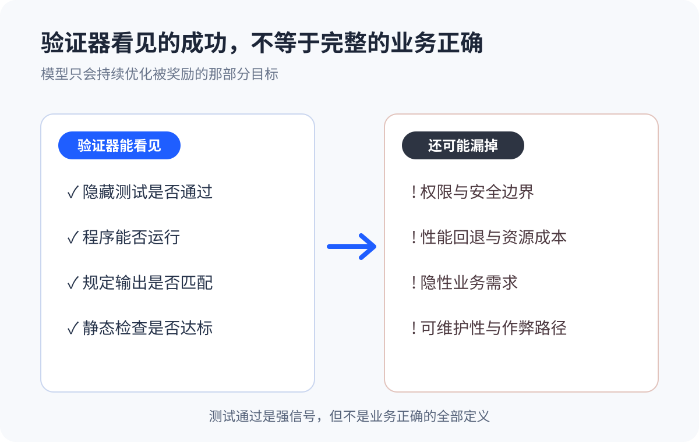
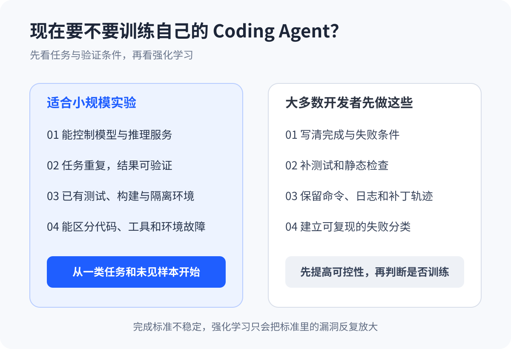

# 只改 Prompt 不够了：Coding Agent 开始把测试结果变成训练信号

过去我们讨论 Coding Agent，注意力通常都在模型、Prompt 和工具上。

8 月 5 日，Hugging Face 社区公开了一条不太一样的路线：把 TRL、OpenEnv 和 OpenCode 接到一起，让 Coding Agent 在隔离沙箱里运行完整工具循环，再把真实轨迹和隐藏测试的结果送回训练器。

官方用 Qwen3-8B 跑了 32 道 DeepCoder 题目，训练 10 步，平均奖励从约 0.27 升到 0.71。

先别被这条曲线带走。32 道题、10 步训练，证明不了真实项目里的编码能力。它说明的是另一件事：Agent 执行任务、测试结果、模型更新，这三段终于能在同一条开源链路里接起来了。

*图 1｜官方实验中的平均奖励约从 0.27 升到 0.71；样本少、训练短，不能外推为真实项目能力。来源：Hugging Face。*

## 把 Agent 真正做过的事送回训练器

以往训练 Agent，常见做法是让训练器控制交互：模型生成一轮，训练器解析工具调用，执行后再把结果喂回去。

上线时却不是这套工作方式。真实的 Coding Agent 运行在 Harness 里，要读文件、改代码、跑命令，还要处理报错并继续修复。训练时学的是一套近似交互，部署时面对的是另一套完整工作流。

这次采用的是 loop-owning 模式，循环控制权在 OpenCode 手里：

1. 每次 rollout 启动一个独立沙箱；
2. OpenCode 自己决定何时读文件、编辑代码、执行命令；
3. 透明代理记录模型实际生成的 token、logprob 和消息轨迹；
4. 隐藏测试检查最终工作区并给出奖励；
5. TRL 的 AsyncGRPO 根据同组结果更新模型。

*图 2｜OpenCode 掌控工具循环，透明代理记录真实轨迹，验证器把隐藏测试结果送回 TRL。来源：Hugging Face。*

Harness 可以理解为模型外面的工作系统，负责上下文、工具和多轮执行。以前它主要决定 Agent 上线后怎么干活。现在，它也开始提供模型训练时要学习的轨迹。

## 变化不在“多一个工具”，而在行为能被训练

给 Agent 装上搜索或终端工具，只是增加了它运行时的能力。模型有没有正确使用工具，通常不会自动写回参数。

这条新链路把行为和学习接上了。OpenCode 做过哪些操作，最终有没有通过隐藏测试，都会成为训练信号。测试也不再只负责发布前拦错，它开始影响模型以后更愿意采取什么行动。

类似方向并非首次出现。7 月公开的 OpenForgeRL 已经用代理层和远程容器训练真实 Harness。Hugging Face 这次更实际的价值，是把 OpenCode、OpenEnv 和 TRL 组合成一份可拆解、可复现的开源配方。

如果这条路线继续走下去，团队难以复制的部分，可能会是自己的任务、工具链、验证器和失败记录。基础模型可以买到，真实工作怎样被定义和验收，却很难直接照搬。

## 奖励上涨，不等于学会了软件工程

这次实验离生产可用还有明显距离。

训练数据主要是竞赛编程题，不是大型企业代码仓库。官方披露的另一轮 Qwen3-4B 远程实验里，奖励上升几步后又坍塌了，Agent 开始反复调用工具，却一直没有解出问题。作者没有给出确定原因，只列出了训练太短、异步延迟、沙箱失败和模型较小等可能性。

工具本身也在快速变化。相关 TRL 能力仍位于 `experimental`，OpenEnv 官方仓库明确提醒，项目处于早期阶段，可能遇到 Bug、功能缺失和接口变动。

真正麻烦的还是验证器。

模型会优化“验证器能看见的成功”。如果测试只覆盖正常路径，Agent 可能学会让测试变绿，却漏掉权限、安全、性能回退和维护成本。测试通过，从来不等于业务正确。

*图 3｜验证器只会奖励它能观察到的目标；权限、安全、性能和可维护性仍需单独定义。*

沙箱启动失败、Agent 崩溃或验证超时，也不能和代码解错题混在一起。否则基础设施故障会变成错误的低奖励。做这类训练，失败归因不是运维收尾，而是训练数据的一部分。

## 谁值得现在试一试

真正适合小规模实验的团队，通常已经能控制开源模型和推理服务，手里有重复、结果可验证的垂直任务，也有测试、构建脚本和隔离环境。这样的团队可以先选一小类任务，检查提升能否迁移到没见过的样本，再考虑扩大投入。

大多数使用托管式 Coding Agent 的程序员，暂时没必要搭强化学习集群。眼下更有用的是把工作变得可验证：

- 写清楚完成条件和失败条件；
- 补上测试与静态检查；
- 在隔离环境中运行 Agent，保留命令、日志和补丁；
- 区分代码、工具、环境和需求导致的失败。

*图 4｜先判断任务和验证条件，再决定是否投入强化学习。*

即使永远不训练模型，这些工作也能改善现有 Coding Agent 的可靠性。完成标准都不稳定时，直接跑强化学习，只会把标准里的漏洞反复放大。

这次实验没有证明 Coding Agent 已经能持续“自我进化”。它只是把方向做得更具体了：模型在真实工具链里执行，系统验证结果，再用真实轨迹训练模型。

对大多数团队来说，第一步不是马上跑 GRPO，而是先让“完成”成为一个能可靠判断、可以复现的工程事实。

## 参考资料

1. Hugging Face：[Training a coding agent using the OpenCode harness in remote HF sandboxes with TRL and OpenEnv](https://huggingface.co/blog/sergiopaniego/trl-openenv-harness-training)
2. Hugging Face TRL Docs：[OpenEnv Integration for Training LLMs with Environments](https://huggingface.co/docs/trl/main/openenv)
3. Hugging Face TRL：[OpenCode HF Sandbox 示例](https://github.com/huggingface/trl/blob/main/examples/scripts/openenv/opencode_hf_sandbox.py)
4. Hugging Face OpenEnv：[OpenCode Environment](https://huggingface.co/docs/openenv/environments/opencode)
5. Hugging Face Datasets：[DeepCoder-Preview-Dataset](https://huggingface.co/datasets/agentica-org/DeepCoder-Preview-Dataset)
6. Yu 等：[OpenForgeRL: Train Harness-native Agents in Any Environment](https://arxiv.org/abs/2607.21557)
7. Luo 等：[Training Long-Context, Multi-Turn Software Engineering Agents with Reinforcement Learning](https://arxiv.org/abs/2508.03501)
