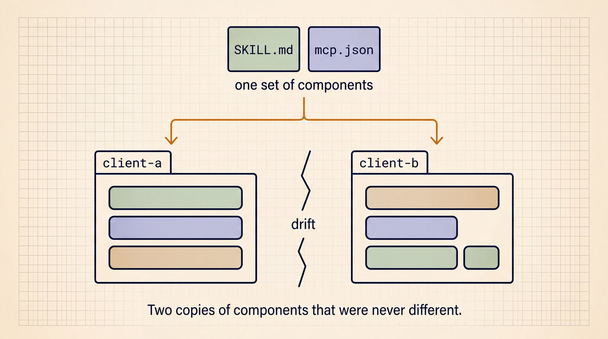
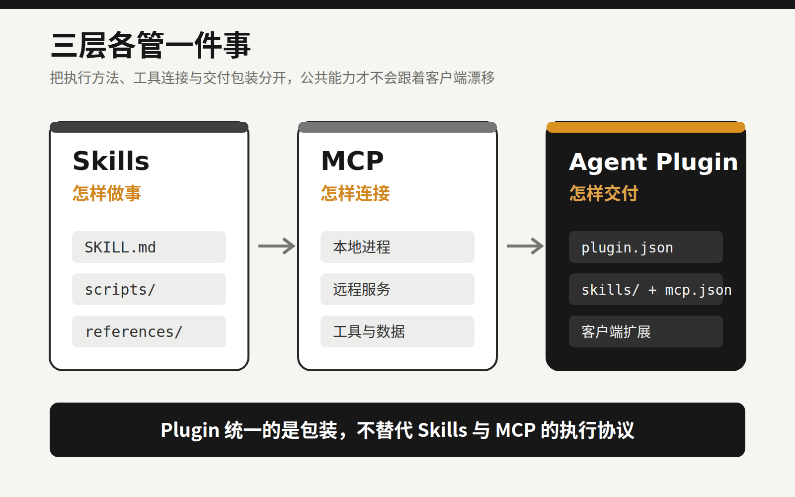
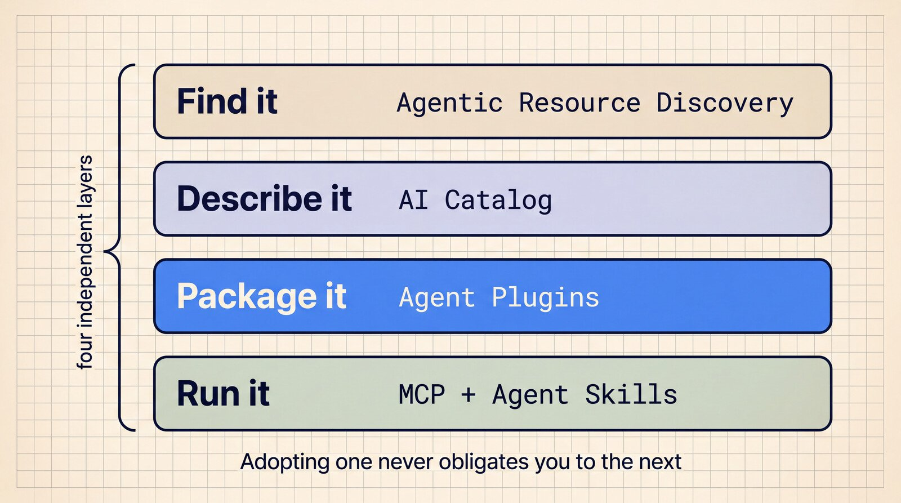
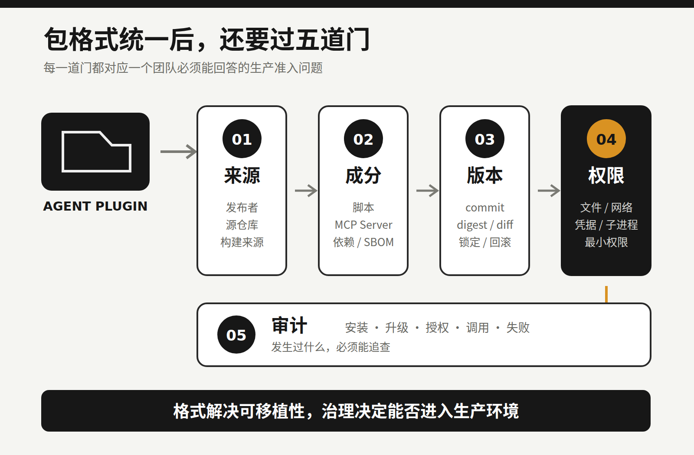

# Agent 的“npm 时刻”来了，但真正的坑才刚开始

假设团队给 Coding Agent 做了一套代码审查能力：Skill 里写审查流程，MCP Server 负责读取内部缺陷库，客户端配置再接上命令和权限。

放进 Cursor 能用。过几天要迁到 Codex、GitHub Copilot 或 Kiro，麻烦来了：目录不一样，manifest 不一样，MCP 配置的写法也不完全一样。团队不得不复制几份包装。公共能力明明是同一套，版本却迟早漂移。



*图 1｜公共组件没有变，客户端包装的复制与分叉却会带来版本漂移。来源：Google Developers Blog。*

8 月 6 日，Google 宣布加入 Agent Plugins 核心维护团队。此前的核心维护者来自 Amazon、Cursor、Microsoft、OpenAI 和 Vercel。这份 1.0.0 规范想解决的正是上面的麻烦：用固定目录和 `plugin.json`，把 Agent Skills、MCP Server 与少量客户端扩展装进一个可迁移的包。

“Agent 的 npm 时刻”是个很形象的说法，但只说对了一半。

Agent Plugins 统一了包装格式，安装、分发、依赖、权限、沙箱和信任体系还没有统一。现在更像是大家终于同意箱子长什么样。至于箱子从哪里来、里面有没有夹带东西、打开后能碰什么，仍然要由客户端和使用团队回答。

## 有了 Skills 和 MCP，为什么还需要 Plugin？

这三个概念经常被放在一起说，其实分工并不相同。

Skills 解决“Agent 应该怎样做事”。一个 Skill 至少有 `SKILL.md`，还可以带脚本、参考资料和素材。它不只是一段被收藏的 Prompt，更像一份可复用的操作手册。

MCP 解决“Agent 怎样连接工具和数据”。它让客户端用统一协议调用本地进程或远程服务，比如数据库、代码平台和内部系统。

Agent Plugins 补上交付层：一套互相配合的 Skill 和 MCP Server，怎样以同一个目录在不同客户端之间移动。

一个最小插件大致长这样：

```text
my-plugin/
├── plugin.json
├── skills/
├── mcp.json
└── com.example.client/
```

根目录的 `plugin.json` 描述插件身份；公共 Skill 放进固定的 `skills/`；MCP 配置固定为 `mcp.json`；客户端特有的 hooks、commands、agents 或 rules，则放进反向域名命名的扩展空间。

这个设计有意保留差异。它没有要求所有 Coding Agent 变成同一个产品，只抽出能复用的公共部分。团队可以维护一份 portable core，再为少数客户端保留薄薄的适配层。



*图 2｜Plugin 统一的是交付包装，不替代 Skills 与 MCP 的执行协议。*

## 1.0.0 标准化了什么，又没管什么？

Agent Plugins 1.0.0 目前仍标注为 Working Draft。它的公共核心很小，只标准化 Skills 和 MCP Servers 两类组件。

规范要求根目录必须有 `plugin.json`，最小必填字段只有 `$schema` 和 `name`。`version` 可以填写，规范也建议使用 SemVer，但它不是最小 manifest 的必填项。

组件的发现位置是固定的，插件不能在 manifest 中随意改路径。某个 MCP Server 启动、连接、认证或握手失败时，客户端应跳过它，继续加载其他独立组件。一个外部服务出错，不至于拖垮整包能力。

这些约束解决了格式与加载边界，却很容易被读成更强的承诺。

“兼容”有明确范围。合规客户端可以只支持 Skills，也可以只支持 MCP；即使都支持 MCP，各自实现的 transport 仍可能不同。一份插件能被识别，不保证它在每个客户端都有一致行为。

路径约束也不是沙箱。包内路径解析后不能逃出插件根目录，但规范明确说明，这不限制子进程运行时能访问哪些文件。一个本地 MCP Server 如果继承了客户端权限，仍可能读取工作区之外的数据。

版本字段更不等于依赖管理。规范没有定义插件依赖、传递依赖、lockfile、更新协议和冲突处理，也没有提供统一 registry。所以这里的“npm 时刻”，准确指向包格式开始统一，包管理生态还远没有完成。

我认为这种克制是合理的。先把最小公共交付单元定下来，后续工具才有共同对象。但工程团队要看清：格式规范替你解决了兼容问题，没有替你承担信任责任。



*图 3｜Agent Plugins 只负责 Package；发现、描述和执行仍是彼此独立的生态层。来源：Google Developers Blog。*

## 能安装，绝不等于能信任

普通软件依赖的风险，主要来自代码、二进制和依赖树。Agent Plugin 多了一种很特殊的攻击面：它还会影响模型怎样理解任务、怎样选择动作。

第一层是指令。

`SKILL.md` 会进入模型上下文。恶意内容未必长得像漏洞代码，它可能伪装成合理的工作步骤，诱导 Agent 读取敏感文件、跳过约束，或者调用不该调用的工具。只扫描传统源代码，发现不了全部问题。

第二层是代码和进程。

Skill 可以携带脚本，`mcp.json` 可以声明本地 MCP Server。MCP 官方安全文档明确提醒，本地 Server 可能以客户端的权限执行；如果来源不可信，又没有沙箱和用户确认，后果包括任意命令执行、数据外传和数据损坏。

第三层是工具与远程服务。

远程 MCP 的工具描述、返回数据和授权范围同样不能默认可信。工具元数据可能误导模型，过大的授权范围也可能把一次普通调用变成数据访问事故。Huang 等人的 2026 年预印本把 tool poisoning 列为客户端攻击面。现阶段，这项研究更适合作为风险信号，不能外推为所有客户端都有同样的问题。

这也是 Agent Plugin 与普通 Prompt 收藏的明显区别。它既可能携带会执行的代码，也可能带入会被模型采纳的指令。

统一格式降低了优秀能力跨客户端复用的成本，也会降低恶意或过期能力的传播成本。过去的包装差异是一种麻烦，同时也是传播摩擦。摩擦被消除后，单个坏插件更容易变成跨客户端的供应链问题。

## 离真正的“npm 时刻”，还差五层

团队判断一个插件能不能进入生产环境，至少要回答五个问题。

第一，它从哪里来？需要能核对发布者身份、源仓库、构建来源、签名和 provenance。只有一个下载地址，不足以建立信任。

第二，里面有什么？除了 `SKILL.md`，还要看脚本、二进制、MCP Server 和运行时依赖。最好能生成 SBOM；做不到时，也要保留一份可审查的组件清单。

第三，究竟装了哪一版？版本号不够，团队还需要 commit 或 digest、升级 diff、锁定记录和回滚办法。否则，同名同版本也可能拿到不同内容。

第四，运行时能做什么？文件、网络、凭据和子进程权限应默认最小化，并由客户端或运行环境强制执行。把“不要读取密钥”写进 Skill 只是提醒，构不成安全边界。

第五，发生过什么？安装、升级、授权、工具调用、失败与高风险操作，都应留下可以追查的记录。



*图 4｜格式解决可移植性，来源、成分、版本、权限和审计共同决定它能否进入生产环境。*

相邻项目已经在补这些能力。Microsoft GitHub 组织下的开源 APM 项目尝试了 lockfile、内容哈希、SBOM 和来源策略；Vercel 的 Skills CLI 解决了跨多种 Agent 客户端安装 Skill 的问题。它们不属于 Agent Plugins 1.0.0，却说明下一轮工程工作已经从“能不能装”走向“能不能验证、限制和回滚”。

接下来，插件生态当然会比数量，但公司更该关心另外几件事：插件能否验证，权限能否收紧，出了问题能否回滚并定位责任。

## 程序员现在先做三件事

标准还在早期，不代表只能等待。团队现在就可以建立一版很轻的准入规则。

### 1. 把 portable core 拆干净

跨客户端通用的流程放在 `skills/`，通用工具连接收敛到 `mcp.json`。hooks、commands、agents 等厂商专属能力留在各自扩展命名空间，不要反过来污染公共核心。

也别为了赶“插件化”潮流，把一个十几行就能讲清的简单 Skill 包成复杂工程。只有当一组说明、脚本与工具确实需要共同迁移时，Plugin 才有价值。

### 2. 把插件纳入依赖审查

团队仓库固定来源和 commit 或 digest。每次升级同时检查 `plugin.json`、`SKILL.md`、scripts 与 `mcp.json` 的 diff，禁止把密钥写进包里，并在 CI 中做 schema 校验、静态扫描和最小回归任务。

当前核心规范没有官方 lockfile。可以先用客户端、相邻工具或团队自己的清单记录实际安装版本。工具不统一，记录不能缺席。

### 3. 默认隔离运行权限

新插件先在测试仓库和低权限环境运行。本地 MCP 启动前展示完整命令并人工确认；文件、网络和凭据按插件分别授权；涉及删除、发布、付款和生产变更的动作，继续保留人工确认与审计。

安全不能依赖模型“记得谨慎”。限制必须落在宿主客户端和运行环境里。

Agent Plugins 带来的实际变化，是 Agent 能力开始变成可版本化、可迁移的工程资产。资产一旦可以像包一样传播，团队就要承担依赖治理责任。

如果你准备尝试，可以先选一个低风险的内部工作流，在两个客户端之间做兼容实验，同时记下来源、版本、权限和回滚方式。

以后再看到一个好用的 Agent Plugin，别急着点击安装。先按审查依赖的方式过一遍，而不是顺手把它丢进 Prompt 收藏夹。

## 参考资料

1. Google Developers Blog：[Agent Plugins package your skills, tools, and more](https://developers.googleblog.com/en/agent-plugins-package-your-skills-tools-and-more/)
2. Agent Plugins：[Specification 1.0.0](https://agent-plugins.org/specification)
3. Agent Plugins：[Build an Agent Plugin](https://agent-plugins.org/plugin-authors)
4. Agent Plugins：[Future Considerations](https://github.com/agentplugins/agent-plugins-spec/blob/main/FUTURE_CONSIDERATIONS.md)
5. Agent Skills：[Specification](https://agentskills.io/specification)
6. Model Context Protocol：[Security Best Practices](https://modelcontextprotocol.io/docs/tutorials/security/security_best_practices)
7. Model Context Protocol：[SEP-1024：本地 Server 安装安全要求](https://modelcontextprotocol.io/seps/1024-mcp-client-security-requirements-for-local-server-)
8. Huang 等：[Model Context Protocol Threat Modeling and Analyzing Vulnerabilities to Prompt Injection with Tool Poisoning](https://arxiv.org/abs/2603.22489)
9. Microsoft：[Agent Package Manager](https://github.com/microsoft/apm)
10. Vercel Labs：[Skills CLI](https://github.com/vercel-labs/skills)
