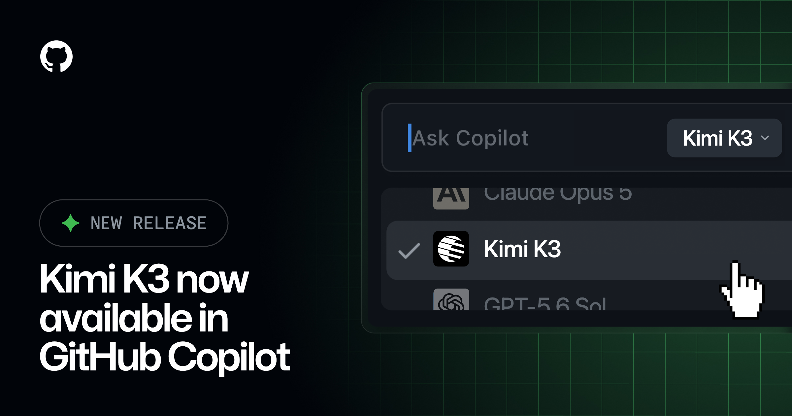
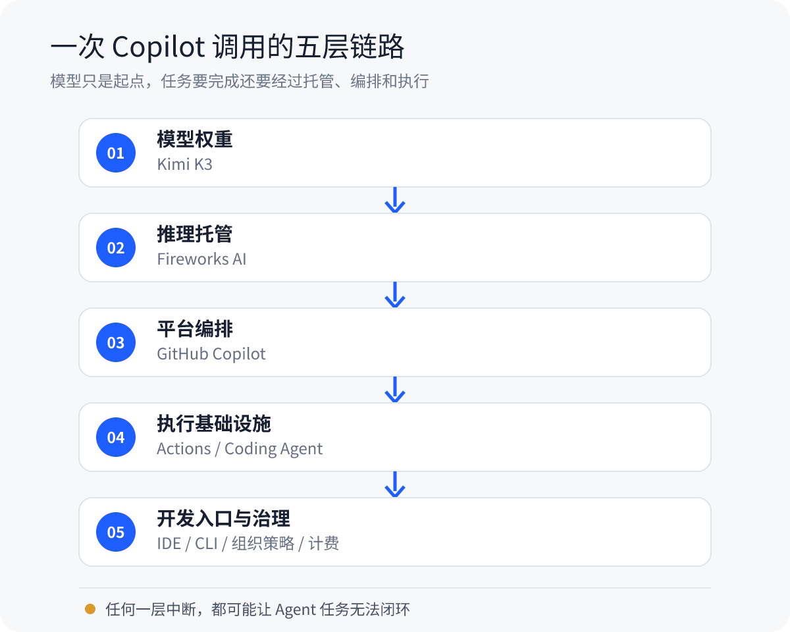
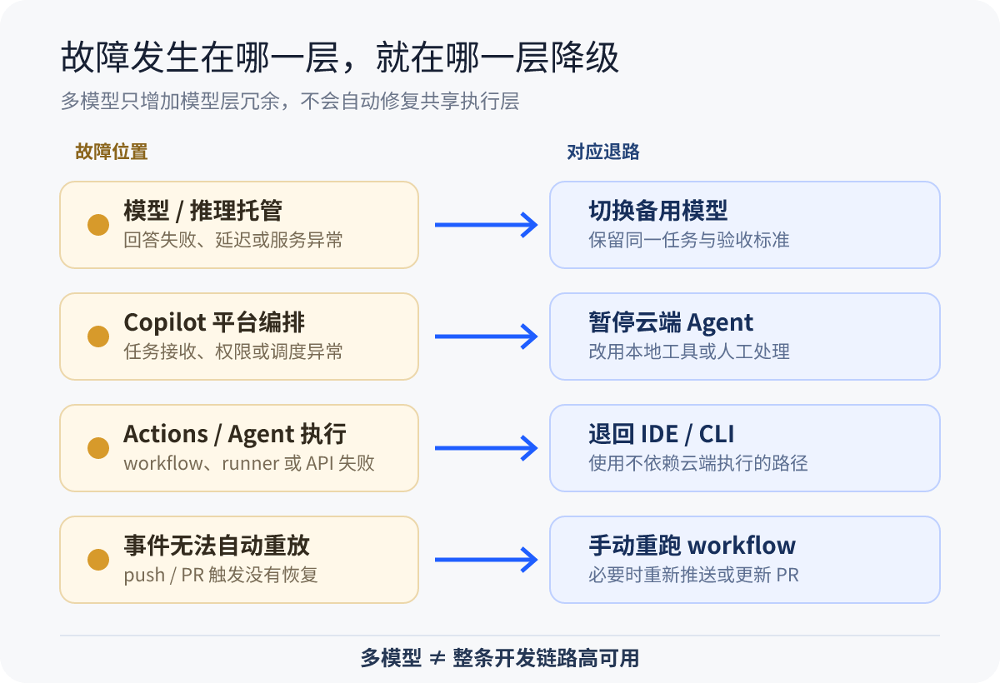

# Kimi K3 进 Copilot，当天暂停又恢复：AI 编程开始拼整条链路

8 月 6 日，GitHub 宣布 Kimi K3 在 Copilot 中正式可用。

后来，同一篇公告多了两条编辑说明：GitHub 先因为 Actions 事故暂停 K3 rollout，事故缓解后又恢复开放。

先说最新状态。Kimi K3 现在是 GA，仍在渐进 rollout。如果模型列表里暂时看不到它，可能只是还没轮到。

也别急着把这件事写成“Kimi 上线当天翻车”。GitHub 状态页显示，Actions 事故开始于 8 月 6 日 15:22 UTC，K3 公告发布于 17:27 UTC。事故比公告早了约两小时，GitHub 至今也没有公布详细根因。没有证据表明 Kimi 引发了事故。

我更关心的是，这段“上线、暂停、恢复”的插曲，刚好把 AI Coding 背后的依赖关系露了出来。模型能不能回答，只是任务能不能完成的一部分。



*图 1｜GitHub 官方公告图：Kimi K3 进入 Copilot 的 model picker。来源：GitHub Changelog。*

## K3 进入 Copilot，开发者实际得到什么

Kimi K3 会逐步向 Copilot Pro、Pro+、Max、Business 和 Enterprise 开放。可用入口包括 VS Code、Visual Studio、JetBrains、Copilot CLI、云端 Coding Agent、github.com 和移动端等。

Business 和 Enterprise 默认关闭 K3，需要管理员显式开启对应策略。GitHub 文档还列出了客户端门槛：VS Code 至少要到 1.131，部分 IDE 的最低版本仍是 TBD。

K3 的官方规格很抢眼：开放权重、原生多模态，2.8T 总参数、每个 token 激活 104B，最长 100 万 token 上下文，定位是长程编程、知识工作和推理。

这些数字来自 Moonshot AI 的模型卡，不是独立实测。模型卡里的 benchmark 使用了不同的运行配置、推理强度和工具条件，不能直接换算成“真实项目里全面超过某个模型”。

K3 也不是 Copilot 的第一个开放权重模型。7 月上线的 Kimi K2.7 Code 才是第一个可从 model picker 选择的开放权重模型。K3 的价值，是把规格更高、上下文更长的模型继续放进开发者已经在用的平台里。

价格已经同步到 GitHub 文档。每 100 万 token，输入 3 美元、缓存输入 0.30 美元、输出 15 美元；实际消耗会折算成 AI credits，1 个 credit 等于 0.01 美元。

K3 并不是 Copilot 中最便宜的开放权重选项。K2.7 Code 的三项价格分别是 0.95、0.19 和 4 美元。长程 Agent 还会反复读代码、调用工具和重试，单 token 价格低不低，并不能回答一个任务最终花了多少钱。

## Actions 事故为什么会影响 Copilot Agent

这次 Actions 事故被 GitHub 标为 critical，从创建到解决持续约 10 小时 42 分钟。

状态页记录的影响包括 workflow 启动失败或中途失败、runner 异常、Webhook 受限和 Actions API 报错。GitHub Pages、Copilot code review、Copilot coding agent 也出现了失败或延迟。

事故恢复后，还有部分 push 和 pull request 触发事件无法自动重放。用户可能需要重新推送、更新 PR，或者手动重跑 workflow。

状态页能告诉我们故障症状和影响范围，却不能替代根因分析。runner 收到无效任务、队列积压、ARC runner pod 卡住，这些都是恢复过程里公开的现象。详细 RCA 还没发布，现在不能把其中任何一项写成最终原因。

但工程上的影响已经很直观。云端 Coding Agent 要接收事件、读取仓库、编排任务、启动执行环境、运行测试，再把结果交回来。Actions 这一层出问题，模型即使还能生成答案，任务闭环也可能断掉。

## 模型选型正在变成一份“运行时合同”

把一次 Copilot 调用拆开，大致会看到这样几层：

```text
Kimi K3 模型权重
  → Fireworks AI 推理托管
  → GitHub Copilot 编排
  → Actions / Agent 执行
  → IDE、组织策略与计费
```



*图 2｜模型只是起点，任务完成还依赖推理托管、平台编排、执行基础设施和开发入口。*

“开放权重”和“本地运行”是两件事。K3 的权重可以获取、部署和微调；在 Copilot 中选择 K3，调用的仍是托管服务。GitHub 文档写明，K3 由 GitHub 托管在 Fireworks AI 上，客户提示词和回复不会发送给原始模型开发者 Moonshot AI。

这句话的边界要看清：不发送给 Moonshot，不等于模型在你的电脑上运行，也不等于代码没有经过托管链路。

于是，团队选模型时要确认的内容变多了：谁负责推理，数据经过哪里，哪些客户端可用，管理员能控制什么，怎样计费，出了故障又能退到哪里。

如果某个模型或推理服务异常，切模型可能有效。可一旦问题出在共享的 Copilot 编排或 Actions 执行层，模型菜单再长也救不了当前任务。多模型解决的是模型层冗余，不等于整条开发链路已经高可用。



*图 3｜故障发生在哪一层，就在哪一层准备退路；多模型不等于整条链路高可用。*

## 谁值得试，怎么试

个人开发者可以从低风险仓库开始。等 K3 出现在 model picker、客户端版本也满足要求后，选 5～10 个真实任务，让它和当前常用模型做同题对比。

任务最好分开测：复杂 Bug、跨文件修改、测试修复、前端视觉任务。记录最终补丁是否正确、首次验证能否通过、工具调用有没有失败、用了多久、消耗了多少 credits。不要只看回答写得像不像，更不要只看榜单名次。

测试、构建和 Diff 审查照常保留。换了模型，并不会少掉这些工程责任。

团队管理员在开启 K3 policy 前，还要核对托管路径、数据治理、内容过滤、适用仓库和预算。降级也要分层准备：模型或推理托管异常时切模型；Actions 或云端 Agent 异常时，退回不依赖这条执行链的本地 IDE、CLI 或人工 workflow。

这次发布给普通程序员多了一个模型选项，也给技术负责人多了一张检查表。

等 K3 出现在你的 picker 里，先别急着找一道 Demo 题。拿同一个真实仓库任务，让它和现用模型各跑一次，比较最终补丁、验证结果和总 credits，再决定要不要换默认模型。

## 参考资料

1. GitHub Changelog：[Kimi K3 is now available in GitHub Copilot](https://github.blog/changelog/2026-08-06-kimi-k3-is-now-available-in-github-copilot/)
2. GitHub Status：[Incident with Actions](https://stspg.io/rcz3fcm83sff)
3. GitHub Docs：[Models and pricing for GitHub Copilot](https://docs.github.com/en/copilot/reference/copilot-billing/models-and-pricing)
4. GitHub Docs：[Supported AI models in GitHub Copilot](https://docs.github.com/en/copilot/reference/ai-models/supported-models)
5. GitHub Docs：[Hosting of models for GitHub Copilot](https://docs.github.com/en/copilot/reference/ai-models/model-hosting)
6. GitHub Changelog：[Kimi K2.7 Code is generally available in GitHub Copilot](https://github.blog/changelog/2026-07-01-kimi-k2-7-is-now-available-in-github-copilot/)
7. Moonshot AI：[Kimi K3 Model Card](https://huggingface.co/moonshotai/Kimi-K3)
8. Moonshot AI：[Kimi K3 GitHub Repository](https://github.com/MoonshotAI/Kimi-K3)
