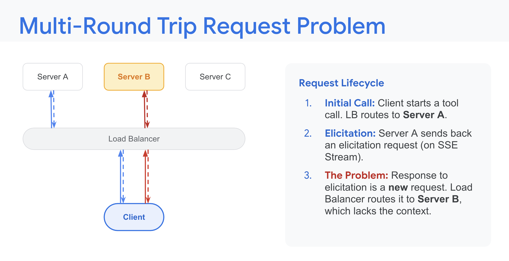
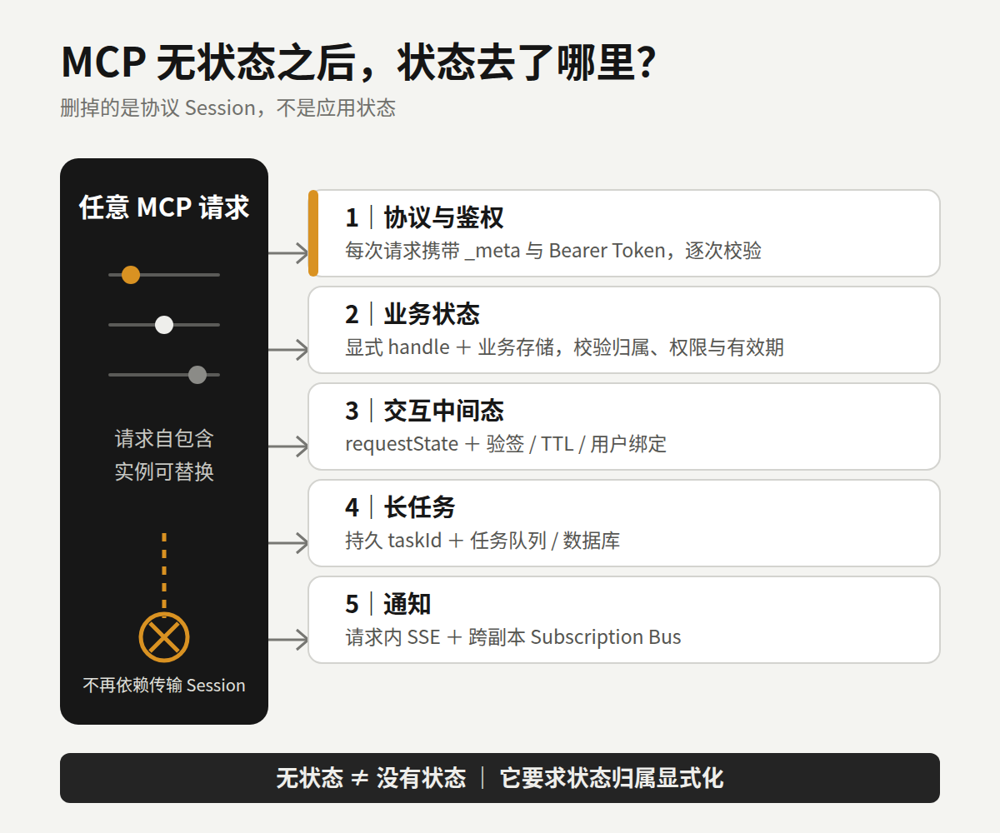
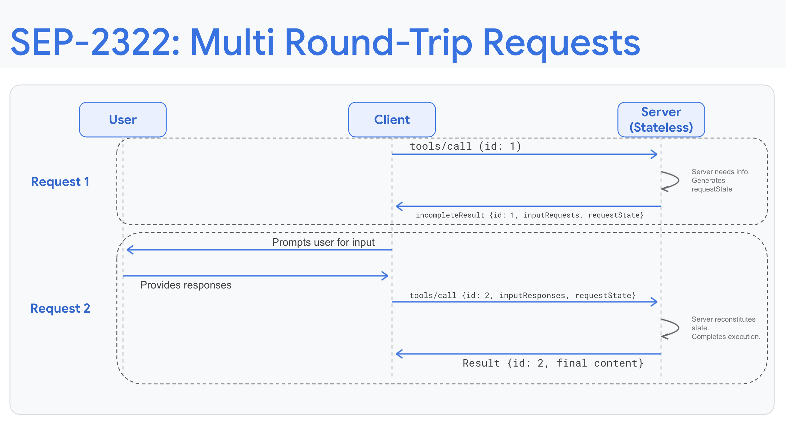
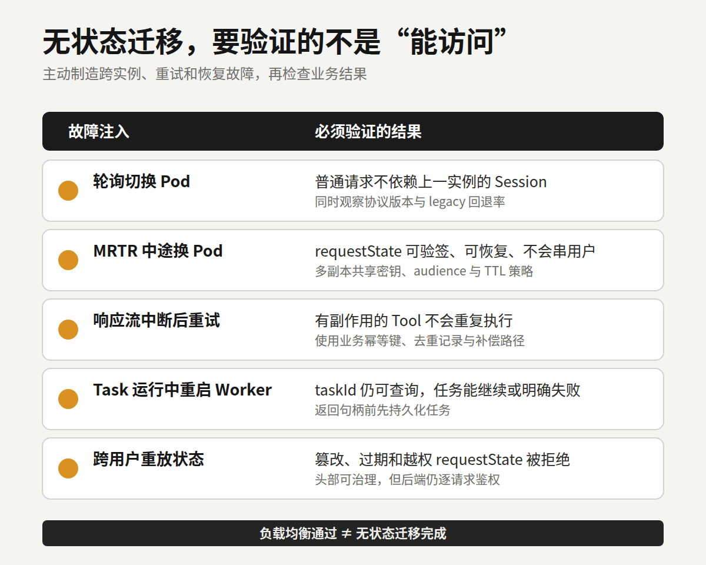

# MCP 删掉 Session 后，Agent 工程开始像真正的分布式系统

一个常见的 MCP 多副本故障，长这样：

```text
initialize  → Pod A → 返回 Mcp-Session-Id
tools/call  → Pod B → Session Not Found
```

服务没有宕机，负载均衡也在正常工作。第二次调用只是去了另一台 Pod，那台机器却不认识第一次调用留下的 Session。

以前的解决办法通常是开粘性路由，或者把 Session 搬进 Redis。单机 Demo 里不显眼的连接状态，到了 Kubernetes、滚动发布和 Serverless 环境里，立刻变成基础设施问题。

7 月 28 日正式发布的 MCP `2026-07-28` 规范，移除了 `initialize` / `initialized` 握手和 `Mcp-Session-Id`。Google 随后从云基础设施角度解读了这次调整。

我更在意的是状态归属发生了变化。MCP 删除的是协议层 Session，应用状态一项也没有凭空消失。



*图 1｜Google 对旧版多轮请求问题的示意：后续请求落到缺少上下文的 Server B。来源：Google Developers Blog。*

## MCP 到底删掉了什么

旧版 MCP 先通过 `initialize` 协商版本和能力。服务端可以签发 Session ID，客户端在后续请求中继续携带。只要实现把能力、订阅或中间状态留在某个进程的内存里，请求就得设法回到原实例。

新版不再维持这段协议生命周期。协议版本和客户端能力跟着每个请求走，客户端身份也建议随请求提供。客户端如果想提前知道服务端支持什么，可以调用 `server/discover`。这是一个可选的发现动作，不是换了名字的新握手。

普通请求由此不再依赖上一次落在哪台机器上。相同配置的实例可以直接放在轮询负载均衡器后面。

这里还有一个容易写错的时间状态。Google 8 月 5 日的文章仍沿用了 release candidate 和 Beta SDK 的说法，但 `2026-07-28` 已经正式发布，TypeScript、Python、Go、C# 四个 Tier 1 SDK 也已经能讲新协议。生产环境能不能切过去，仍取决于团队实际使用的客户端、SDK 版本和扩展支持，不能只看规范发布日期。

## 它为什么更适合普通云基础设施

协议 Session 被拿掉后，负载均衡不必再为它配置 sticky routing。Pod 重启、横向扩容和滚动发布，也不用为了保住协议会话把后续请求送回原实例。没有业务状态的工具服务，放进 Serverless 或 scale-to-zero 环境会更顺手。

网关也能看懂更多信息。新版 Streamable HTTP 请求要求带上 `MCP-Protocol-Version` 和 `Mcp-Method`；调用 Tool、读取 Resource 或获取 Prompt 时，还会带 `Mcp-Name`。网关可以按版本、方法和名称路由、计量或限流，不必先拆开完整的 JSON-RPC Body。

`tools/list`、`resources/list` 等结果增加了 `ttlMs` 和 `cacheScope`。客户端能判断目录多久仍然新鲜，以及能否使用共享缓存。这个能力只覆盖规定的列表和资源结果，不代表有副作用的 Tool 可以随便缓存。

GitHub MCP Server 已经给出一个实际案例。它在支持新规范时，删除了专门为协议 Session 设置的 Redis 读写；网关也不再为了日志和 secret scanning 深度解析每个 Payload。

别把这个案例外推成“升级后就能删 Redis”。浏览器实例、审批、任务进度、锁和业务缓存仍需要可靠存储。GitHub 删除的是协议会话设施，不是业务状态。

## 状态去了哪里

无状态的准确含义是：服务端理解当前请求，不需要依赖前一次传输会话。新架构里的状态，大致分散到了五个位置。



*图 2｜协议 Session 被移除后，协议、业务、交互、任务和通知状态需要分别找到明确载体。*

协议和授权信息跟着请求走。协议版本、客户端能力在每个请求的 `_meta` 里。启用 HTTP 授权时，Bearer Token 也要随每次请求发送，服务端逐次验证 token 的 audience 和权限。只在 `initialize` 做一次权限判断的代码需要重构。

业务状态变成显式 handle。购物篮、浏览器实例或工作区仍然可以跨调用保存，但应由服务端签发标识，再让模型作为 Tool 参数带回。服务端要检查标识属于谁、有没有权限、是否过期。把 `Mcp-Session-Id` 改名为 `conversation_id`，然后继续用它装下全部上下文，只是搬了家。

交互中间状态进入 MRTR。Multi Round-Trip Requests 让服务端先返回 `input_required`，客户端补齐确认或参数后，再带着 `inputResponses` 重试原调用。可选的 `requestState` 会经过客户端返回，必须按不可信输入处理。它需要防篡改、设置有效期；含有用户数据时，还要和原用户绑定。多 Pod 部署要共享验签或解密配置，否则第一次落在 A、重试落在 B，B 可能读不懂这段状态。



*图 3｜SEP-2322 将一次多轮交互拆成两个自包含请求，由 `requestState` 帮助服务端恢复必要状态。来源：Google Developers Blog。*

长任务进入 Tasks 扩展。双方都声明支持 `io.modelcontextprotocol/tasks` 后，服务端可以返回持久化的 `taskId`，客户端用 `tasks/get` 轮询，也可以补充输入或请求取消。协议统一了任务生命周期，任务队列、数据库和幂等仍由团队建设。服务端必须先把任务存好，再把句柄交给客户端。

通知则留在请求范围的流和订阅总线里。无状态不等于没有 SSE。单个 POST 仍可流式返回进度和日志，`subscriptions/listen` 也能建立长时响应流。区别在于，流不再承担跨请求的协议 Session。多副本要可靠分发订阅通知，通常还得接共享 Pub/Sub。

## 可靠性问题没有被协议升级包办

新版移除了 SSE Event ID 和 `Last-Event-ID` 断点重放。响应流断开后，客户端要用新的 JSON-RPC 请求 ID 再发一次。

最大的坑是幂等。假设一个“创建云资源”Tool 已经执行成功，响应却在返回途中断了。客户端看到的只是失败，它很可能重试，服务端便可能创建第二份资源。JSON-RPC `id` 只用于关联请求和响应，不是业务幂等键。去重记录、唯一约束、重复结果和补偿路径都要由应用定义。

标准 HTTP 头也不是信任来源。`Mcp-Method` 和 `Mcp-Name` 方便网关下发策略，后端仍需校验头部与 Body 是否一致，并检查 token、Tool 权限和业务 handle 的归属。

普通请求可以换 Pod，不代表执行中的请求会自动转移。流中断后的重试、MRTR 跨实例恢复、Task 在进程退出后继续可查、订阅事件跨副本送达，是四件不同的事。上线前要分别验证。

## 迁移前先做五项检查

### 1. 先看版本分布

记录客户端和 SDK 版本、新版协商成功率、legacy 回退率。旧客户端仍可能发送 `initialize` 并要求 Session。没有这些数据，就不要直接拆兼容路径。

### 2. 搜出隐式状态

检查 `Mcp-Session-Id`、内存 transport Map、initialize 缓存、连接级能力、GET/SSE 通知和 EventStore 假设。要找的是所有依赖“下一次还会回到这里”的代码。

### 3. 给副作用 Tool 补幂等

按业务定义 idempotency key、去重记录、重复请求返回值和补偿办法。退款、发消息、建资源这类操作尤其不能借用传输层请求 ID。

### 4. 做跨实例故障注入

在两轮 MRTR 之间切换 Pod，在 Task 运行中重启 Worker，主动打断响应流再重试。还要验证篡改、过期和跨用户重放的 `requestState` 会被拒绝。

### 5. 灰度下掉旧设施

先让新旧协议双栈运行，观察 HeaderMismatch、legacy 回退、重复执行和任务恢复失败，再决定何时移除 sticky routing 与 Session Store。SDK 声称支持新规范，不是生产验收条件。



*图 4｜负载均衡能访问只是起点；跨实例恢复、幂等、任务持久化和越权防护要分别验证。*

## Agent 工程回到了分布式系统常识

过去做 MCP Server，很多精力放在 Tool Schema 和 handler 上。协议改成无状态核心后，服务能不能进生产，更取决于状态机、幂等、请求级授权和任务恢复。

新规范清除了协议层对云部署的一部分阻碍，也把应用层原本含糊的责任摆到了台面上。它没有替团队解决分布式系统问题，只是让这些问题很难再藏在一条 Session 后面。

下一次把 MCP Server 扩到三个副本时，别只看请求能不能被负载均衡。主动让一台实例在请求中途退出，再检查系统会不会重复执行、串错用户，或者丢掉一项长任务。

这才是无状态架构的验收题。

## 参考资料

1. Model Context Protocol：[The 2026-07-28 Specification](https://blog.modelcontextprotocol.io/posts/2026-07-28/)
2. Model Context Protocol：[Key Changes in 2026-07-28](https://modelcontextprotocol.io/specification/2026-07-28/changelog)
3. Google Developers Blog：[Scaling AI Agent Infrastructure with the MCP Stateless updates](https://developers.googleblog.com/en/scaling-ai-agent-infrastructure-with-the-mcp-stateless-updates/)
4. GitHub Changelog：[GitHub MCP Server supports the next MCP specification](https://github.blog/changelog/2026-07-23-github-mcp-server-supports-the-next-mcp-specification/)
5. Model Context Protocol：[SEP-2575: Make MCP Stateless](https://modelcontextprotocol.io/seps/2575-stateless-mcp)
6. Model Context Protocol：[SEP-2322: Multi Round-Trip Requests](https://modelcontextprotocol.io/seps/2322-MRTR)
7. Model Context Protocol：[MCP Tasks Extension](https://modelcontextprotocol.io/extensions/tasks/overview)
8. Model Context Protocol：[Authorization 2026-07-28](https://modelcontextprotocol.io/specification/2026-07-28/basic/authorization)
9. Model Context Protocol Python SDK：[Deploy & scale](https://py.sdk.modelcontextprotocol.io/run/deploy/)
10. Model Context Protocol：[Conformance Tests](https://github.com/modelcontextprotocol/conformance)
